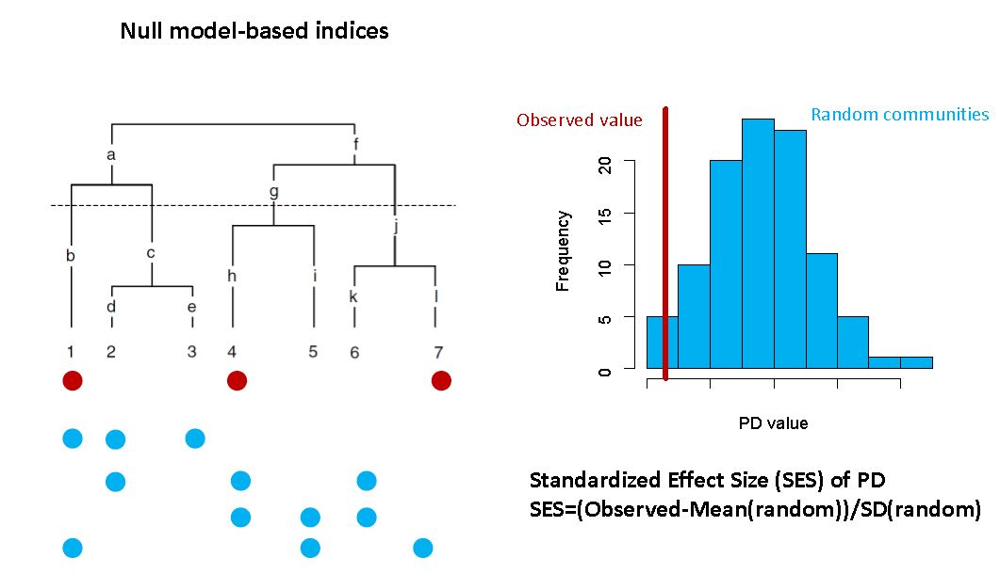

```{r setup, include=FALSE}
knitr::opts_chunk$set(echo = TRUE)
```

&nbsp;
_[back to overview](index.html)_
&nbsp;
&nbsp;


**Preparation:** Please open your RStudio project and download the new data ('Phylogeny_ConservativeCon_Checklist.zip', 'palms_specsxsites_phylo.csv' and 'palmtree_pruned.nex') for today from [Stud-IP](https://studip.uni-goettingen.de/dispatch.php/course/files/index/74501b33f332a6d238443bfbd502cc6c?cid=1746ae3fe971afbf90b74e3d64389586) and unzip and copy them into your .Rproj folder '/Data/'. You can use `getwd()` to locate your current working directory, which should be your project folder. Please install the following R-packages using `install.packages()`:  

* `ape`  
* `Taxonstand`  
* `sf`  
* `dplyr` 
* `psych`  
* `picante`  
* `pez`
* `ggplot2`
* `cowplot`
* `GGally`
* `RColorBrewer`

&nbsp;

If you want to visualize this tutorial in the viewer inside RStudio (to save space on your screen) run the following chunk of code:
```{r viewer, eval=FALSE}
install.packages("rstudioapi") # install an R-package required for this step
dir <- tempfile()
dir.create(dir)
download.file("https://gift.uni-goettingen.de/mcmmb/index.html", destfile = file.path(dir, "index.html"))
download.file("https://gift.uni-goettingen.de/mcmmb/Day7.html", destfile = file.path(dir, "Day7.html"))
htmlFile <- file.path(dir, "Day7.html")
rstudioapi::viewer(htmlFile)
```
Now you can conveniently copy code from the viewer into your script.  
&nbsp;

**Load R packages & island data set**  


```{r message=FALSE, warning=FALSE, include=FALSE}
library(dplyr)
library(sf) #  Geospatial fun
library(Taxonstand)
library(ape)
library(picante)
library(pez)
library(psych)
library(ggplot2)
library(cowplot)
library(GGally)
library(RColorBrewer)
```

```{r eval=FALSE}
library(dplyr) # basic data manipulation

library(sf) #  Geospatial fun

library(Taxonstand) # Taxonomic standardisation of plant species names
library(ape) # Analyses of phylogenetics and evolution
library(picante) # Phylogenies and ecology
library(pez) # Phylogenies and ecology

library(psych) # basic stats stuff
library(ggplot2) # for plotting
library(cowplot) # for multi-panel plots
library(GGally) # pairs plot
library(RColorBrewer) # fancy colour palettes
```
&nbsp;

## 1. Load data into R  

### a. Load a phylogeny \& look at structure of 'multiPhylo' object  

*Explanation of structure of a phylogeny in R*  
**edge**: a two-column matrix where each row represents a branch (or edge) of the tree. The nodes and the tips are symbolized with integers. The n tips are numbered from 1 to n, and the m (internal) nodes from n+1 to n+m (the root being n + 1). For each row, the first column gives the ancestor.    

**edge.length (optional)**: A numeric vector giving the lengths of the branches given by edge.  

**tip.label**: A vector of mode character giving the labels of the tips. The order of these labels corresponds to the integers 1 to n in edge.    

**Nnode**: An integer value giving the number of nodes in the tree (m).  

**node.label** (optional): A vector of mode character giving the labels of the nodes (ordered in the same way as the tip.label).    

**root.edge** (optional): A numeric value giving the length of the branch at the root if it exists. 

**load multi-tree object into R**  

Data from Faurby, S., Eiserhardt, W.L., Baker, W.J. & Svenning, J.-C. (2016).  
An all-evidence species-level supertree for the palms (Arecaceae).  
_Molecular Phylogenetics and Evolution_, 100, 57-69.  

```{r echo=TRUE}
palmtrees <- read.nexus("data/Phylogeny_ConservativeCon_Checklist.nex")

palmtrees

palmtrees[[1]]

palmtree <- palmtrees[[1]]
str(palmtree)

# Number of nodes (m) (n is the number of tips)
palmtree$Nnode

# Tip labels
head(palmtree$tip.label)
length(palmtree$tip.label)

# Edges
head(palmtree$edge)
range(palmtree$edge[, 1]) # ranges from n+1 to n+m (length(palmtree$tip.label) + palmtree$Nnode)

is.rooted(palmtree) # does the phylogeny have a root? i.e. can the most basal ancestor be identified?
```
&nbsp;

We can also plot the phylogenetic tree.
```{r echo=TRUE, fig.height=9, fig.width=9}
plot(palmtree, type = "fan", cex = 0.3,
     edge.color = "gray70", tip.color = "#ef8a62",
     main = "Phylogenetic tree for 2539 palm species")
```
&nbsp;


### b. Loading palm distribution data  

Data from  Kreft, H., Sommer, J.H. & Barthlott, W. (2006).  
The significance of geographic range size for spatial diversity  
patterns in Neotropical palms. _Ecography_, 29, 21-30.  


```{r echo=TRUE}
species <- read.csv("data/palms_species_per_gridcell.csv",
                    sep = ",", stringsAsFactors = FALSE)
head(species)
length(unique(species$grid_id)) # number of grid cells
```
&nbsp;


### c. Exercise I  

**Tasks**:    
1. Add a column for the full species name with "_" as separator: "species".      
2. How many palm species occur in the Americas?  
3. How many and which species in the palm distribution dataset are missing from the phylogeny?  
&nbsp;

**Exercise I solutions:**  
_Add a column for the full species name with an underscore as the separator: "species"_  
```{r echo=FALSE}
species$species <- paste(species$GENUS, species$EPITHET, sep = "_")
species$species <- paste0(species$GENUS, "_", species$EPITHET)
unique(species$species)[1:5]; head(species)
```
&nbsp;

_How many palm species occur in the Americas?_

```{r echo=FALSE}
length(unique(species$species))
```
&nbsp;

_How many and which species in the palm distribution dataset are missing from the phylogeny?_

```{r echo=FALSE}
table(unique(species$species) %in% palmtree$tip.label) # need for unique species
# length(unique(species$species[which(!species$species %in% palmtree$tip.label)]))
# sum(!unique(species$species) %in% palmtree$tip.label)

# first five palm species
unique(species$species[which(!species$species %in% palmtree$tip.label)])[1:5]
```
&nbsp;


## 2. Taxonomic standardization  

**Write species missing from phylogeny into a vector**
```{r echo=TRUE}
specmissing <- unique(species$species[which(!species$species %in% palmtree$tip.label)])
head(specmissing)

specmissing <- gsub("_", " ", specmissing) # replace underscore with a space
head(specmissing)
```
&nbsp;


**Match palm species names to those in [The Plant List](http://www.theplantlist.org/)**
It is always important to check whether you have access to an updated taxonomy.

```{r echo=TRUE, message=FALSE, warning=FALSE}
taxstand <- TPL(specmissing, diffchar = 2, max.distance = 1)
# head(warnings())
head(taxstand)[, c(1, 11:16)]
```
&nbsp;

**Replace old names by new names \& overwrite the combined species name**
```{r echo=TRUE}
for (i in 1:nrow(taxstand)){
  species$GENUS[which(species$GENUS == taxstand$Genus[i] &
                        species$EPITHET == taxstand$Species[i])] <- taxstand$New.Genus[i]
  species$EPITHET[which(species$GENUS == taxstand$Genus[i] &
                          species$EPITHET == taxstand$Species[i])] <- taxstand$New.Species[i]
}

# update the combined species name
species$species <- paste(species$GENUS, species$EPITHET, sep = "_")
```
&nbsp;

**Check names that are not in the phylogeny**  
```{r echo=TRUE}
specmissing <- unique(species$species[which(!species$species %in% palmtree$tip.label)])
specmissing
length(specmissing)
```
&nbsp;

_Missing species would have to be looked up and added manually to the phylogeny by an expert._   
_If missing species cannot be added reliably, we need to remove them from the dataset for analysis._  

```{r echo=TRUE}
# Removal of the species not in the phylogeny
species <- species[which(!species$species %in% specmissing), ]
```
&nbsp; 

## 3. Loading grid shapefile and changing resolution  
**Read in polygon shapefile**  
```{r echo=TRUE, message=FALSE, warning=FALSE}
# gridcells corresponding to palm distribution data and americas coastline
grid <- st_read("data/30min_grid_select50/30min_grid_select50%.shp")
americas <- st_read("data/americas/americas.shp")

# remember to define the Coordinate Reference System (CRS)
st_crs(grid) <- "+proj=longlat +ellps=WGS84 +no_defs"
st_crs(americas) <- "+proj=longlat +ellps=WGS84 +no_defs"

# Rename ID column for matching
names(grid)[1] <- "grid_id"
```
&nbsp; 

**Convert the grid shapefile to a coarser resolution to have fewer grid cells**  
```{r echo=TRUE}
# convert into points shapefile
grid_centroids <- st_centroid(grid)

ggplot(grid_centroids) +
  geom_sf(shape=20) +
  geom_sf(data = americas, fill = NA, color = "black") +
  theme_void() + ylim(-40, 40)
```
&nbsp; 

**Add coordinates to SpatialPolygonsDataframe**  
```{r echo=TRUE}

# Add latitude and longitude as columns
head(grid)
grid <- cbind(grid, st_coordinates(grid_centroids))
names(grid)[4:5] <- c("longitude", "latitude")
head(grid)
```
&nbsp; 

**Make new IDs for neighbouring cells**  
```{r echo=TRUE}
range(grid$longitude)
range(grid$latitude)

longitude <- seq(-116, -34, by = 2)
latitude  <- seq(-35, 35, by = 2)

new_ID_matrix <- matrix(c(1:(length(longitude)*length(latitude))),
                        nrow = length(longitude), ncol = length(latitude),
                        dimnames = list(longitude, latitude), byrow = TRUE)
new_ID_matrix[1:5, 1:5]

grid$new_ID <- NA

for(i in 1:nrow(grid)){
  grid$new_ID[i] <- new_ID_matrix[which(longitude < grid$longitude[i] & 
                                               (longitude + 2) > grid$longitude[i]),
                                       which(latitude < grid$latitude[i] &
                                               (latitude + 2) > grid$latitude[i])]
}

head(grid)
```
&nbsp; 

**Join neighbouring cells based on new IDs \& aggregate species distribution data using the new grid**  
```{r echo=TRUE}

grid_2degrees <- group_by(grid, new_ID)
grid_2degrees <- summarise(grid_2degrees, do_union = TRUE, is_coverage = TRUE)

head(grid_2degrees)

ggplot(grid_2degrees) +
  geom_sf(fill = "gray90") +
  geom_sf(data = americas, fill = NA, color = "black") +
  theme_void() + ylim(-40, 40)

# Add new ID also to species data.frame
species <- inner_join(species, st_drop_geometry(grid), by = "grid_id")
head(species)
```
&nbsp;


## 4. Calculating phylogenetic community metrics  
**Prune phylogeny to exclude species not in palm distribution data**  
_Make sure that the same number of species in your data set are in your phylogeny_

```{r echo=TRUE}
palmtree_pruned <- drop.tip(palmtree,
                            palmtree$tip.label[which(!palmtree$tip.label %in% unique(species$species))])
length(palmtree$tip.label)
length(palmtree_pruned$tip.label)
length(unique(species$species))

write.nexus(palmtree_pruned, file = "data/palmtree_pruned.nex")
```
&nbsp;

**Convert long table to species by grid-cell table (a community matrix)**
```{r echo=TRUE}
species <- unique(species[, c("new_ID", "species")])
species_grid <- as.data.frame.matrix(table(species))
species_grid <- as.matrix(species_grid)

dim(species_grid)
species_grid[1:5, 1:5]

write.csv(species_grid, file = "data/palms_specsxsites_phylo.csv")
```
&nbsp;

```{r message=FALSE, warning=FALSE, echo=TRUE}
# if you have a hard time reading in the large palm phylogeny or
# in case you got stuck above
palmtree_pruned <- read.nexus("data/palmtree_pruned.nex")
species_grid <- as.matrix(read.csv("data/palms_specsxsites_phylo.csv", row.names = 1))
```

**Calculate phylogenetic diversity**  

We here calculate the Faith's PD (phylogenetic diversity index), which can be written like this:
<br>
$$
PD = \sum_{branches}l(b)
$$
with $l$ the length of a branch $b$.

```{r message=FALSE, warning=FALSE, r,echo=TRUE}
# ?pd
pd_palms <- pd(species_grid, palmtree_pruned)
dim(pd_palms) # one value per grid cell
pd_palms <- data.frame(new_ID=as.integer(row.names(species_grid)), pd_palms)
head(pd_palms)
```
&nbsp;

`pd()` calculates Faith's PD and a corrected version of it being the residuals of a regression with total abundance or species richness per plot. Lets look into this:

```{r message=FALSE, warning=FALSE, echo=TRUE, fig.height=5, fig.width=8}
pd_model <- lm(PD ~ SR, data = pd_palms)
pd_palms$residuals <- residuals(pd_model)

plot_grid(nrow = 1, ncol = 2,
ggplot(pd_palms, aes(SR, PD)) +
  geom_point(color = "black", alpha = 0.3) +
  stat_smooth(method = "lm", formula = y ~ x, color = "red") +
  labs(x = "Species_number", y = "Faith's PD") +
  theme_bw(),
ggplot(pd_palms, aes(SR, residuals)) +
  geom_point(color = "black", alpha = 0.3) +
  labs(x = "Species_number", y = "Faith's PD residuals") +
  theme_bw())
```


**Calculate generic phylogenetic metrics (absolute and standardized)**  

Phylogenetic diversity metrics are standardized by first using a null model to generate expected values.  
The principle of null models is illustrated in the following figure:  

```{r null_model_principle, fig.label = "Null model principle", out.width = "70%", echo = FALSE}

```

Then, the observed value is compared to the null, usually using standardized effect sizes (SES):
<br>
$$SES = (observed - mean.null)/sd.null$$
where _mean.null_ is the mean of the null values and _sd.null_ is the standard deviation of the null values.  

Null models can also apply to other phylogenetic diversity indices like the Mean Pairwise Distance (MPD) and the Mean Nearest Taxon Distance (MNTD).

MPD consists in calculating all the pairwise distances between species in a grid cell and then takes the mean.
<br>
MNTD calculates the mean distance separating each species in the grid cell from its closest relative.
These indices are described in Webb el al. (2002).

```{r message=FALSE, warning=FALSE, echo=TRUE, fig.height=5, fig.width=8}
c.data <- comparative.comm(palmtree_pruned , species_grid)
pd.null <- generic.null(c.data, c(.pd, .mpd, .mntd), null.model = "richness",
                        comp.fun = .ses,permute = 100) 
colnames(pd.null) <- c("Faith_PD", "Corrected_FaithPD", "MPD", "MNTD")
rownames(pd.null) <- sites(c.data)
pd.null <- data.frame(pd.null)
pd.null$new_ID <- as.numeric(rownames(pd.null))

dim(pd.null); head(pd.null)

# select columns of interest for final data set
pd.out <- pd.null[, c("new_ID", "Faith_PD.observed", "Faith_PD.SES",
                      "MPD.observed", "MPD.SES", "MNTD.observed", "MNTD.SES")] 
pd.out[is.na(pd.out)] <- 0  # change NAs to zeroes; zero phylogenetic diversity if grid has only 1 spp!

head(pd.out)
head(pd_palms)

palmdiversity <- left_join(pd_palms, pd.out)

plot_grid(nrow = 1, ncol = 2,
ggplot(palmdiversity, aes(SR, Faith_PD.SES)) +
  geom_point(color = "black", alpha = 0.3) +
  stat_smooth(method = "lm", formula = y ~ x, color = "red") +
  labs(x = "Species_number", y = "Faith's PD standardized") +
  theme_bw(),
ggplot(palmdiversity, aes(Faith_PD.observed, Faith_PD.SES)) +
  geom_point(color = "black", alpha = 0.3) +
  stat_smooth(method = "lm", formula = y ~ x, color = "red") +
  labs(x = "Faith's PD observed", y = "Faith's PD standardized") +
  theme_bw())
```
&nbsp;


### a. Exercise II  

**Tasks**:  
1. Plot correlations among the diversity metrics in the palm diversity data.frame.   
2. Join the 'palmdiversity' data.frame to the grid_2degrees shapefile to be able to link the diversity metrics and the poylgons for plotting.   
3. Plot maps with colours according to the diversity metrics.  

**Exercise II solutions:**


_Plot correlations among the diversity metrics_  
```{r echo=FALSE, fig.height=10, fig.width=10}
ggpairs(palmdiversity[, c(3:10)],
        upper = list(continuous = wrap(ggally_cor, digits = 1))) +
  theme_bw()

#psych::pairs.panels(palmdiversity[, c(3:10)], method = "pearson",
#             density = FALSE, ellipses = FALSE, hist.col = "white")
```
&nbsp;

_Join the palmdiversity data.frame to the shapefile with the new gridcell IDs_  

```{r echo=FALSE}
head(grid_2degrees)
grid_2degrees <- left_join(grid_2degrees, palmdiversity, by = "new_ID")
head(grid_2degrees)
```
&nbsp;


_Plot maps with different colours for each diversity metric_  

*Species richness, PD, MPD \& MNTD (absolute)*  
```{r echo=FALSE, fig.height=10, fig.width=6.6, message=FALSE, warning=FALSE}

plot_grid(nrow = 2, ncol = 2,
ggplot(grid_2degrees) +
  geom_sf(color = NA, aes(fill = SR)) +
  geom_sf(data = americas, fill = NA, color = "black") +
  labs(title = "Palm species richness") +
  scale_fill_viridis_c("Species\nnumber") +
  theme_void() + theme(plot.title = element_text(margin=margin(0,0,10,0))) + 
  ylim(-40, 40),
ggplot(grid_2degrees) +
  geom_sf(color = NA, aes(fill = PD)) +
  geom_sf(data = americas, fill = NA, color = "black") +
  labs(title = "Faith's Phylogenetic diversity") +
  scale_fill_viridis_c("PD (my)") +
  theme_void() + theme(plot.title = element_text(margin=margin(0,0,10,0))) + 
  ylim(-40, 40),
ggplot(grid_2degrees) +
  geom_sf(color = NA, aes(fill = MPD.observed)) +
  geom_sf(data = americas, fill = NA, color = "black") +
  labs(title = "Mean pairwise distance") +
  scale_fill_viridis_c("MPD (my)") +
  theme_void() + theme(plot.title = element_text(margin=margin(0,0,10,0))) + 
  ylim(-40, 40),
ggplot(grid_2degrees) +
  geom_sf(color = NA, aes(fill = MNTD.observed)) +
  geom_sf(data = americas, fill = NA, color = "black") +
  labs(title = "Mean nearest taxon distance") +
  scale_fill_viridis_c("MNTD (my)") +
  theme_void() + theme(plot.title = element_text(margin=margin(0,0,10,0))) + 
  ylim(-40, 40))

# par(mfrow = c(2, 2), mar = rep(1, 4), oma = rep(0, 4))
# 
# my.class.fr <- classIntervals(grid_2degrees@data$SR, n = 10, style = "equal") # bin data into n quantiles
# my.pal <- matlab.like(10)
# my.col.fr <- findColours(my.class.fr, my.pal) # ramp colors based on classInts
# 
# plot(grid_2degrees, col = my.col.fr, border = NA, axes = FALSE)
# title(main = "Species_richness", line = -3)
# plot(americas, add = TRUE)
# 
# my.class.fr <- classIntervals(grid_2degrees@data$Faith_PD.observed,
#                               n = 10, style = "equal") # bin data into n quantiles
# my.pal <- matlab.like(10)
# my.col.fr <- findColours(my.class.fr, my.pal) # ramp colors based on classInts
# 
# plot(grid_2degrees, col = my.col.fr, border = NA, axes = FALSE)
# title(main = "Faith's PD",line = -3)
# plot(americas, add = TRUE)
# 
# my.class.mpd <- classIntervals(grid_2degrees@data$MPD.observed,
#                                n = 10, style = "equal") # bin data into n quantiles
# my.pal2 <- matlab.like(10)
# my.col.mpd <- findColours(my.class.mpd, my.pal2) # ramp colors based on classInts
# 
# plot(grid_2degrees, col = my.col.mpd, border = NA, axes = FALSE)
# title(main = "MPD", line = -3)
# plot(americas, add = TRUE)
# 
# my.class.mntd <- classIntervals(grid_2degrees@data$MNTD.observed,
#                                 n = 10, style = "equal") # bin data into n quantiles
# my.pal3 <- matlab.like(10)
# my.col.mntd <- findColours(my.class.mntd, my.pal3) # ramp colors based on classInts
# 
# plot(grid_2degrees, col = my.col.mntd, border = NA, axes = FALSE)
# title(main = "MNTD", line = -3)
# plot(americas, add = TRUE)
```
&nbsp;


*PD, MPD \& MNTD (standardized)*  
```{r echo=FALSE, fig.height=5, fig.width=10}

plot_grid(nrow = 1, ncol = 3,
ggplot(grid_2degrees) +
  geom_sf(color = NA, aes(fill = Faith_PD.SES)) +
  geom_sf(data = americas, fill = NA, color = "black") +
  labs(title = "Standardized Faith's PD") +
  scale_fill_gradient2("PDses", low = brewer.pal(11, "PiYG")[1],
  mid = brewer.pal(11, "PiYG")[6], high = brewer.pal(11, "PiYG")[11], midpoint = 0) +
  theme_void() + theme(plot.title = element_text(margin=margin(0,0,10,0))) + 
  ylim(-40, 40),
ggplot(grid_2degrees) +
  geom_sf(color = NA, aes(fill = MPD.SES)) +
  geom_sf(data = americas, fill = NA, color = "black") +
  labs(title = "Standardized MPD") +
  scale_fill_gradient2("MPD", low = brewer.pal(11, "PiYG")[1],
  mid = brewer.pal(11, "PiYG")[6], high = brewer.pal(11, "PiYG")[11], midpoint = 0) +
  theme_void() + theme(plot.title = element_text(margin=margin(0,0,10,0))) + 
  ylim(-40, 40),
ggplot(grid_2degrees) +
  geom_sf(color = NA, aes(fill = MNTD.SES)) +
  geom_sf(data = americas, fill = NA, color = "black") +
  labs(title = "Standardized MNTD") +
  scale_fill_gradient2("MNTD", low = brewer.pal(11, "PiYG")[1],
  mid = brewer.pal(11, "PiYG")[6], high = brewer.pal(11, "PiYG")[11], midpoint = 0) +
  theme_void() + theme(plot.title = element_text(margin=margin(0,0,10,0))) + 
  ylim(-40, 40))


# par(mfrow = c(1, 3), mar = rep(1, 4), oma = rep(0, 4))
# 
# my.class.fr2 <- classIntervals(grid_2degrees@data$Faith_PD.SES,
#                                n = 10, style = "equal") 
# my.pal4 <- matlab.like(10)
# my.col.fr2 <- findColours(my.class.fr2, my.pal4) # ramp colors based on classInts
# 
# plot(grid_2degrees, col = my.col.fr2, border = NA)
# title(main = "standardised Faith's PD", line = -3)
# plot(americas, add = TRUE)
# 
# my.class.fr3 <- classIntervals(grid_2degrees@data$MPD.SES,
#                                n = 10, style = "equal") # bin data into n quantiles
# my.pal5 <- matlab.like(10)
# my.col.fr3 <- findColours(my.class.fr3, my.pal5) # ramp colors based on classInts
# 
# plot(grid_2degrees, col = my.col.fr3, border = NA)
# title(main = "standardised MPD", line = -3)
# plot(americas, add = TRUE)
# 
# my.class.fr4 <- classIntervals(grid_2degrees@data$MNTD.SES,
#                                n = 10, style = "equal") # bin data into n quantiles
# my.pal6 <- matlab.like(10)
# my.col.fr4 <- findColours(my.class.fr4, my.pal6) # ramp colors based on classInts
# 
# plot(grid_2degrees, col = my.col.fr4, border = NA)
# title(main = "standardised MNTD", line = -3)
# plot(americas, add = TRUE)

```
&nbsp;

# References
[Faurby S, Eiserhardt WL, Baker WJ, Svenning JC. An all-evidence species-level supertree for the palms (Arecaceae). Mol Phylogenet Evol. 2016 Jul;100:57-69.](https://doi.org/10.1016/j.ympev.2016.03.002)  

[Faith D.P. (1992) Conservation evaluation and phylogenetic diversity. Biological Conservation, 61, 1-10](https://doi.org/10.1016/0006-3207(92)91201-3)

[Kreft, H., Sommer, J.H. and Barthlott, W. (2006), The significance of geographic range size for spatial diversity patterns in Neotropical palms. Ecography, 29: 21-30.](https://doi.org/10.1111/j.2005.0906-7590.04203.x)

[The Plant List](http://www.theplantlist.org/)

[Phylogenies and Community Ecology Campbell O. Webb, David D. Ackerly, Mark A. McPeek, Michael J. Donoghue Annual Review of Ecology and Systematics 2002 33:1, 475-505](https://www.annualreviews.org/doi/abs/10.1146/annurev.ecolsys.33.010802.150448)
