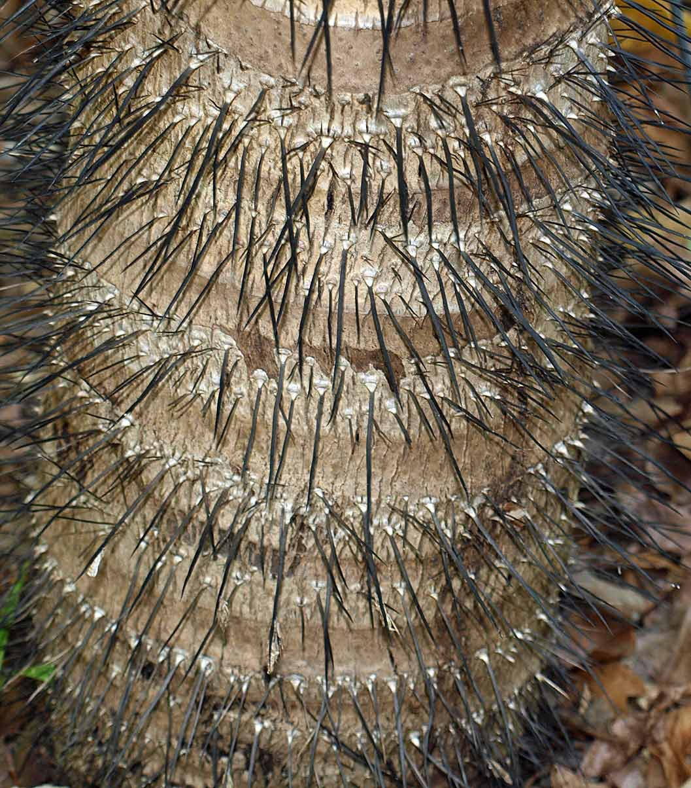
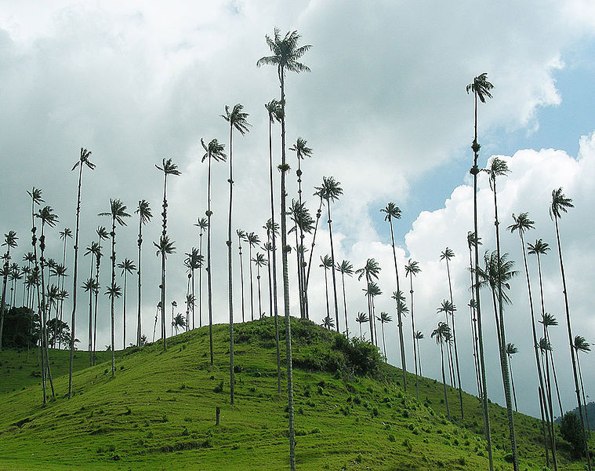
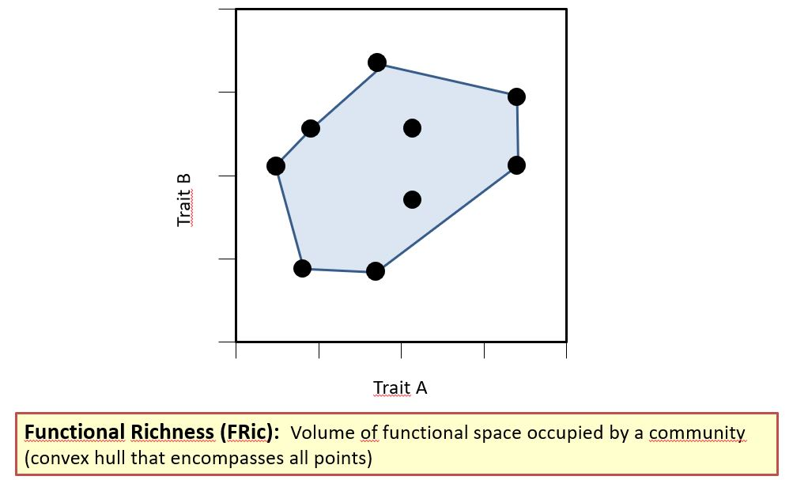

```{r setup, include = FALSE}
knitr::opts_chunk$set(echo = TRUE)
```

&nbsp;
_[back to overview](index.html)_
&nbsp;
&nbsp;

**Preparation:** Please open your RStudio project and download the new data () for today from [Stud-IP](https://studip.uni-goettingen.de/dispatch.php/course/files/index/) and unzip and copy them into your .Rproj folder '/data/'. You can use `getwd()` to locate your current working directory, which should be your project folder. Please install the following R-packages using `install.packages()`:  

* `FD`
* `dplyr`
* `RColorBrewer`
* `psych`
* `rgdal`
* `rgeos`
* `ade4`

&nbsp;

If you want to visualize this tutorial in the viewer inside RStudio (to save space on your screen) run the following chunk of code:
```{r viewer, eval=FALSE}
install.packages("rstudioapi") # install an R-package required for this step
dir <- tempfile()
dir.create(dir)
download.file("https://gift.uni-goettingen.de/mcmmb/index.html", destfile = file.path(dir, "index.html"))
download.file("https://gift.uni-goettingen.de/mcmmb/Day8.html", destfile = file.path(dir, "Day8.html"))
htmlFile <- file.path(dir, "Day8.html")
rstudioapi::viewer(htmlFile)
```
Now you can conveniently copy code from the viewer into your script.

**Load R packages & island data set**  

```{r message = FALSE, warning = FALSE, include = FALSE}
library(FD)
library(dplyr)
library(RColorBrewer)
library(psych)
library(rgdal)
library(rgeos)
library(ade4)
```

```{r eval = FALSE}
library(FD) # Functional diversity
library(dplyr) # data.frame operations
library(RColorBrewer) # color gradients
library(psych) # pair plot
library(rgdal) # shapefile
library(rgeos) # grid cells centroids
library(ade4) # Dissimilarity matrix and PCoA
```
&nbsp;

# 1. Data  
## 1.1.  Loading palm distribution data  
Data from  Kreft, H., Sommer, J.H. & Barthlott, W. (2006).  
The significance of geographic range size for spatial diversity  
patterns in Neotropical palms. _Ecography_, 29, 21-30.  

We here import a transformed version of the data to speed up the calculations. Now each cell is at a 2 degrees resolution, and species occurrences have been aggregated into these bigger cells. See [practical 7](https://gift.uni-goettingen.de/mcmmb/Day7.html#loading-grid-shapefile-and-changing-resolution) for more details.

```{r echo=TRUE}
species <- readRDS("data/palm_species_per_gridcell_2degrees.rds")

head(species)
length(unique(species$new_ID)) # number of grid cells
length(unique(species$species)) # number of species

# Spatial data
# gridcells corresponding to palm distribution data and americas coastline
grid <- readOGR("data/2degrees_grid/data_2degrees_grid_.shp",
                integer64 = "allow.loss")
americas <- readOGR("data/americas/americas.shp")

# remember to include coordinate system
grid@proj4string <- CRS("+proj=longlat +ellps=WGS84 +no_defs")
americas@proj4string <- CRS("+proj=longlat +ellps=WGS84 +no_defs")

# have a look at the grid's attribute table
head(grid@data)
head(species)
# Latitude and longitude centroids have already been calculated

# Plot
plot(grid, border= "darkgrey")
plot(americas, add = TRUE)
```
&nbsp;

## 1.2. Trait data
A database of palm traits has recently been published. These data come from Kissling, W. D., Balslev, H., Baker, W. J., Dransfield, J., Göldel, B., Lim, J. Y., Onstein, R. E., & Svenning, J.-C. (2019).  
PalmTraits 1.0, a species-level functional trait database of palms worldwide.  
_Scientific Data_, 6(1), 1–13.  

```{r tra_palm}
# Traits
tra <- read.table("data/palm_traits/PalmTraits_1.0.txt",
                  stringsAsFactors = FALSE, sep= "\t", header = TRUE)
dim(tra)
head(tra)
```

Many traits are available. Before checking them, we merge the trait table with the species data frame.

## 1.2. Merging tables
```{r merge}
# Replace space with underscore in trait table before merging
tra$SpecName <- gsub(" ", "_", tra$SpecName)
sp_tra <- left_join(species[!duplicated(species$species), ], # we here remove duplicates per species
                    tra,
                    by = c("species" = "SpecName")) # species are not called the same in both tables
dim(sp_tra)
head(sp_tra)
```

## 1.3. Trait description
When using a functional trait table, several facets have to be inspected. Specifically, we should look at:
- trait type (*continuous*, _ordinal_, _categorical_, _binary_)
- trait coverage (how many species have a trait value)
- trait distribution (if too asymmetrical, log-transformation)
- trait correlation (are some traits carrying the same information?)
- ecological significance (is the trait varying against environment? biotic variable? physiological process?)

### 1.3.1. Life form and habit
Binary traits except when one species varies (in that case 0, 1 or 2).
Acaulescent (leaves and inflorescence rise from the ground, i.e. lacking a visible aboveground stem), erect or climbing.

StemSolitary (single-stemmed versus clustered)

```{r tra_palm2}
# Frequency of each category
table(sp_tra$Climbing)
table(sp_tra$Acaulescent)
table(sp_tra$Erect)

# Recoding 2 as 1 (when populations vary in one trait)
# => not enough entries
sp_tra[which(sp_tra$Climbing == 2), "Climbing"] <- 1
sp_tra[which(sp_tra$Acaulescent == 2), "Acaulescent"] <- 1
sp_tra[which(sp_tra$Erect == 2), "Erect"] <- 1

table(sp_tra$Climbing) # very unbalanced
table(sp_tra$Acaulescent)
table(sp_tra$Erect)

# For sake of simplicity, we won't consider the life form here
```

### 1.3.2. Armature
Whether bearing some form of spines at the stem or not, or both if populations vary in this trait.
Whether bearing some form of spines on the leaves or not, or both if populations vary in this trait.

```{r non_armed_stem, fig.label = "Cocos_nucifera", out.width = "50%", echo = FALSE}

```

```{r armed_stem, fig.label = "Aiphanes_minima", out.width = "50%", echo = FALSE}

```

```{r armature}
# http://idtools.org/id/palms/palmid/gallery.php
table(sp_tra$StemArmed); table(sp_tra$LeavesArmed)
table(sp_tra$StemArmed, sp_tra$LeavesArmed)

# Plot
plot(table(sp_tra$StemArmed, sp_tra$LeavesArmed),
     main = "Frequency of Armature classes",
     xlab = "Stem Armed", ylab = "Leaves Armed")

prpX <- prop.table(table(sp_tra$StemArmed))
prpY <- prop.table(table(sp_tra$StemArmed, sp_tra$LeavesArmed), margin = 1)
text(prpX/2 * c(1,-1) + 0:1,
     prpY/2 * c(-1,-1,1,1) + c(1,1,0,0),
     paste("n=", table(sp_tra$StemArmed, sp_tra$LeavesArmed)))

# For sake of simplicity, we won't use these 2 traits here
```

### 1.3.3. Stem size
Continuous trait
```{r stem_size}
# Plot
plot(sp_tra$MaxStemHeight_m, sp_tra$MaxStemDia_cm, pch = 16,
     xlab = "Maximum Stem Height (m)",
     ylab = "Maximum Stem Diameter (cm)")
rect(xleft = 18, xright = 55, ybottom = 0, ytop = 10,
     lwd = 1.5, lty = 2, add = TRUE, col = "#e3484850")# "firebrick3")

# Create color column based on Climbing life form
sp_tra$col <- c("firebrick3", "dodgerblue", "dodgerblue")[
  as.numeric(cut(sp_tra$Climbing, breaks = 3))]

plot(sp_tra$MaxStemHeight_m, sp_tra$MaxStemDia_cm,
     bg = sp_tra$col, pch = 21, col = "black",
     xlab = "Maximum Stem Height (m)",
     ylab = "Maximum Stem Diameter (cm)")
legend("topright", title = "Climbing life form", bg = "grey",
       legend = unique(sp_tra$Climbing),
       col = c("firebrick3", "firebrick3", "dodgerblue", "dodgerblue"),
       pch = 16)
text(50, 65, labels = "Ceroxylon quindiuense")
arrows(x0 = 55, x1 = 61, y0 = 60, y1 = 40,
       length = 0.1, lwd = 2)

# UnderstoreyCanopy
# table(sp_tra$UnderstoreyCanopy, sp_tra$Acaulescent)
# boxplot(sp_tra$MaxStemHeight_m ~ sp_tra$UnderstoreyCanopy)
# We won't use this sp_trait
```

The world's tallest monocotyledon:
```{r tallest_palm, fig.label = "Ceroxylon quindiuense", out.width = "50%", echo = FALSE}

```

### 1.3.4. Leaf
Many leaf traits are available, and they may carry similar information. Let's make a pair plot to have a quick look at this.


```{r leaf_traits}
# Pair plot
pairs.panels(sp_tra[, c("MaxLeafNumber", "Max_Blade_Length_m",
                        "Max_Rachis_Length_m", "Max_Petiole_length_m")],
             density = FALSE, ellipses = FALSE, hist.col = "grey")
```

The last three traits are highly correlated. We will just keep the blade length.

### 1.3.5. Fruit
Similarly, many fruit traits are available. Let's make another pair plot.
<br>

```{r fruit_traits}
# Pair plot
pairs.panels(sp_tra[, c("AverageFruitLength_cm", "MinFruitLength_cm",
                        "MaxFruitLength_cm", "AverageFruitWidth_cm",
                        "MinFruitWidth_cm", "MaxFruitWidth_cm")],
             density = FALSE, ellipses = FALSE, hist.col = "grey")

# All traits are highly correlated, we'll take only AverageFruitLength_cm

# Also some categorical traits
boxplot(sp_tra$AverageFruitLength_cm ~ sp_tra$FruitSizeCategorical,
        col = "grey",
        xlab = "FruitSizeCategorical", ylab = "AverageFruitLength (cm)")

table(sp_tra$FruitShape)
# too detailed and not complete

# table(sp_tra$FruitColorDescription)
# table(sp_tra$MainFruitColors)
table(sp_tra$Conspicuousness) # summarises colors
```

## 1.4. Traits selected
Based on the different trait properties we just observed, we can come with a subset of relevant traits to keep.
Note that we just conserve the continuous traits for sake of simplicity.
<br>

```{r tra_select}
tra_select <- c("MaxStemHeight_m", "MaxLeafNumber", "Max_Blade_Length_m",
                "AverageFruitLength_cm")

# Only columns of interest
sp_tra <- sp_tra[, c("species", tra_select)]

# Distribution of continuous traits
pairs.panels(sp_tra[, tra_select], density = FALSE, ellipses = FALSE, hist.col = "grey")

# Log-transforming all the continuous traits
sp_tra$log_height <- log(sp_tra$MaxStemHeight_m + 1) # adding 1 here to avoid -Inf values
sp_tra$log_leaf_nb <- log(sp_tra$MaxLeafNumber)
sp_tra$log_blade <- log(sp_tra$Max_Blade_Length_m)
sp_tra$log_fruit_length <- log(sp_tra$AverageFruitLength_cm)

# Plot
plot(sp_tra$AverageFruitLength_cm, sp_tra$log_fruit_length, pch = 16,
     xlab = "Fruit length (cm)", ylab = "Log-transformed fruit length")

# Change vector of traits of interest
tra_select <- c("log_height", "log_leaf_nb", "log_blade", "log_fruit_length")
```

# 2. Trait maps
## 2.1. Trait distribution
We here aim at mapping the distribution of one trait. We do it here with the maximal stem height.
<br>

```{r tra_distribution}
# Map of trait coverage: MaxStemHeight_m
# Add the trait coverage to grid spatialpolygondataframe
species_height <- left_join(
  species[, c("new_ID", "species", "Long", "Lat")],
  sp_tra[, c("species", "MaxStemHeight_m")],
  by = "species")
head(species_height)

# tapply function
head(tapply(species_height$MaxStemHeight_m,
            species_height$new_ID,
            function(x) mean(x, na.rm = TRUE))) # argument na.rm necessary here

grid_mean_height <- tapply(species_height$MaxStemHeight_m,
                           species_height$new_ID,
                           function(x) mean(x, na.rm = TRUE))
grid_mean_height <- data.frame(
  new_ID = names(grid_mean_height),
  mean_height = as.numeric(grid_mean_height))
dim(grid_mean_height); head(grid_mean_height)

# Plot
str(grid_mean_height$new_ID); str(grid@data$new_ID)
grid_mean_height$new_ID <- as.numeric(as.character(grid_mean_height$new_ID))
grid@data <- left_join(grid@data, grid_mean_height, by = "new_ID")

# Make a color ramp
col_func <- colorRampPalette(c("olivedrab1", "olivedrab4"))
col_func(10)
my_col <- col_func(length(unique(grid@data$mean_height)))

# Rank variable for color assignment
grid@data$order <- findInterval(grid@data$mean_height,
                                sort(grid@data$mean_height))

# Plot of height distribution
plot(grid, col = col_func(nrow(grid@data))[grid@data$order],
     border = NA,
     main = "Max. Stem height\nper grid cell (m)")
plot(americas, add = TRUE)

legend("bottomleft", # position
       legend = range(grid@data$mean_height, na.rm = TRUE), 
       title = "Average max. stem height (m)",
       fill = col_func(2),
       cex = 0.7,
       bty = "n") # no box around it
```

## 2.2. Trait coverage
We also saw that not all species have a trait value. We therefore need to make a trait coverage assessment.
<br>

```{r tra_coverage}
head(tapply(species_height$MaxStemHeight_m,
            species_height$new_ID,
            function(x) sum(is.na(x))/length(x))) # coverage calculation

grid_coverage_height <- tapply(species_height$MaxStemHeight_m,
                               species_height$new_ID,
                               function(x) sum(is.na(x))/length(x))
grid_coverage_height <- data.frame(
  new_ID = names(grid_coverage_height),
  coverage_height = as.numeric(grid_coverage_height))
dim(grid_mean_height); head(grid_mean_height)

# Conversion to percentages
grid_coverage_height$coverage_height <- 100 *
  grid_coverage_height$coverage_height
head(grid_mean_height)

# Make a color ramp
col_cov <- colorRampPalette(c("grey10", "grey90"))

# Plot
grid_coverage_height$new_ID <- as.numeric(as.character(grid_coverage_height$new_ID))
grid@data <- left_join(grid@data, grid_coverage_height, by = "new_ID")

# Rank variable for color assignment
grid@data$order_cov <- findInterval(grid@data$coverage_height,
                                    sort(grid@data$coverage_height))

# Plot of height distribution
plot(grid, col = col_cov(nrow(grid@data))[grid@data$order_cov],
     border = NA,
     main = "Max. Stem height coverage")
plot(americas, add = TRUE)

legend("bottomleft", # position
       legend = range(grid@data$coverage_height, na.rm = TRUE), 
       title = "Coverage max. stem height (%)",
       fill = col_cov(2),
       cex = 0.7,
       bty = "n") # no box around it
```

We can see that the coverage has a huge influence on the conclusion we drew before.
<br>

# 3. Trait space
The main objective here is to reduce dimensionality, in order to get the main axes of variation between species.

## 3.1. Distances
First step is to compute a distance matrix.

If you had only numerical traits, you could use the Euclidean distances. If doing so, it would be similar to a PCA.  

Now, because we also have categorical traits, we cannot simply use the Euclidean distances and we need a way to combine several types of data.  

For this, we'll use the Gower's distance implemented in the `dist.ktab` function.

```{r dist_ktab}
# Making a trait table without NAs
tra_select
sp_tra_complete <- sp_tra[, tra_select]
rownames(sp_tra_complete) <- sp_tra$species
sp_tra_complete <- sp_tra_complete[complete.cases(sp_tra_complete), ]
dim(sp_tra_complete); head(sp_tra_complete)

# Gower distance
?dist.ktab

ktab1 <- ktab.list.df(list(sp_tra_complete))

mat_dissim <- dist.ktab(ktab1, type = "Q", option = "scaledBYrange") # scaled quantitative traits
head(mat_dissim)

# n*(n-1)/2 pairwise combinations
all.equal(length(mat_dissim),
          ((nrow(sp_tra_complete)*(nrow(sp_tra_complete)-1))/2))
```

## 3.2. Principal Coordinate Analysis (PCoA)

PCoA relies on the distances between samples. Therefore, the first step of a PCoA is the construction of a (dis)similarity matrix. While PCA is based on Euclidean distances, PCoA can handle (dis)similarity matrices calculated from quantitative, semi-quantitative, qualitative, and mixed variables.  
<br>
In our case, we would get a similar result with a PCA since we only have continuous traits and we used Euclidean distances in the dissimilarity matrix.
<br>
As always, the choice of (dis)similarity measure is critical and must be suitable to the data in question. For abundance data, Bray-Curtis distance is often recommended. You can use Jaccard index for presence/absence data. When the distance metric is Euclidean, PCoA is equivalent to PCA. 

```{r pcoa}
# ape::pcoa() # other option
pcoa_palm <- dudi.pco(mat_dissim, scannf = FALSE, nf = 6)
```

**Merging coordinates with trait table and plot**
```{r pcoa_palm_plot}
# Coordinates of the individuals
head(pcoa_palm$li)

# Barplot of eigenvectors
barplot((pcoa_palm$eig / sum(pcoa_palm$eig))*100)

# Table with the coordinates on the first 2 axes only
coord_sp_pcoa <- pcoa_palm$li[, 1:2]
coord_sp_pcoa$sp <- rownames(coord_sp_pcoa)
head(coord_sp_pcoa)

# Merge back PCoA coordinates to complete trait table
sp_tra_complete$sp <- rownames(sp_tra_complete)
sp_tra_complete <- left_join(sp_tra_complete, coord_sp_pcoa, by = "sp")
head(sp_tra_complete)

# Plot
plot(sp_tra_complete$A1, sp_tra_complete$A2, pch = 16,
     main = "Species coordinates on the PCoA",
     xlab = paste0("PCoA1 (",
                   round((pcoa_palm$eig / sum(pcoa_palm$eig))*100, 2)[1],
                   "%)"),
     ylab = paste0("PCoA2 (",
                   round((pcoa_palm$eig / sum(pcoa_palm$eig))*100, 2)[2],
                   "%)"))

# Add the projection of traits on this plot
ordiplot(pcoa_palm,
         main = "Species coordinates on the PCoA",
         xlab = paste0("PCoA1 (",
                       round((pcoa_palm$eig / sum(pcoa_palm$eig))*100, 2)[1],
                       "%)"),
         ylab = paste0("PCoA2 (",
                       round((pcoa_palm$eig / sum(pcoa_palm$eig))*100, 2)[2],
                       "%)"))
# ?envfit
ef <- envfit(pcoa_palm, sp_tra_complete[, tra_select])
ef
plot(ef)
```

Similarly as for the vegetative height of palms, we can plot the first axes of the PCoA.
<br>

```{r pcoa_axes_map}
# Plot of A1 and A2
# Map of trait coverage: MaxStemHeight_m
species_pcoa <- left_join(
  species[, c("new_ID", "species", "Long", "Lat")],
  sp_tra_complete[, c("sp", "A1", "A2")],
  by = c("species" = "sp"))
head(species_pcoa)

# tapply function
grid_mean_pcoa1 <- tapply(species_pcoa$A1,
                          species_pcoa$new_ID,
                          function(x) mean(x, na.rm = TRUE))
grid_mean_pcoa1 <- data.frame(
  new_ID = names(grid_mean_pcoa1),
  mean_pcoa1 = as.numeric(grid_mean_pcoa1))
head(grid_mean_pcoa1)

grid_mean_pcoa2 <- tapply(species_pcoa$A2,
                          species_pcoa$new_ID,
                          function(x) mean(x, na.rm = TRUE))
grid_mean_pcoa2 <- data.frame(
  new_ID = names(grid_mean_pcoa2),
  mean_pcoa2 = as.numeric(grid_mean_pcoa2))

# Plot
grid_mean_pcoa1$new_ID <- as.numeric(as.character(grid_mean_pcoa1$new_ID))
grid@data <- left_join(grid@data, grid_mean_pcoa1, by = "new_ID")
grid_mean_pcoa2$new_ID <- as.numeric(as.character(grid_mean_pcoa2$new_ID))
grid@data <- left_join(grid@data, grid_mean_pcoa2, by = "new_ID")

# Make a color ramp
col_func <- colorRampPalette(c("olivedrab1", "olivedrab4"))
col_func(10)
my_col <- col_func(length(unique(grid@data$mean_pcoa1)))

col_func2 <- colorRampPalette(c("cadetblue1", "cadetblue4"))
col_func2(10)
my_col2 <- col_func2(length(unique(grid@data$mean_pcoa2)))

# Rank variable for color assignment
grid@data$order <- findInterval(grid@data$mean_pcoa1,
                                sort(grid@data$mean_pcoa1))
grid@data$order2 <- findInterval(grid@data$mean_pcoa2,
                                 sort(grid@data$mean_pcoa2))

# Plot of PCoA1 and PCoA2 distribution
par(mfrow = c(1, 2))
plot(grid, col = col_func(nrow(grid@data))[grid@data$order],
     border = NA,
     main = "Average PCoA1\nper grid cell (m)")
plot(americas, add = TRUE)

legend("bottomleft", # position
       legend = round(range(grid@data$mean_pcoa1, na.rm = TRUE), 2), 
       title = "Average PCoA1",
       fill = col_func(2),
       cex = 0.7,
       bty = "n") # no box around it

plot(grid, col = col_func2(nrow(grid@data))[grid@data$order2],
     border = NA,
     main = "Average PCoA2\nper grid cell (m)")
plot(americas, add = TRUE)

legend("bottomleft", # position
       legend = round(range(grid@data$mean_pcoa2, na.rm = TRUE), 2), 
       title = "Average PCoA2",
       fill = col_func2(2),
       cex = 0.7,
       bty = "n") # no box around it
```

# 4. Functional diversity

We here just focus on functional richness which is the volume of functional space occupied by a community convex hull that encompasses all points.  

```{r frich_image, fig.label = "Functional richness", out.width = "50%", echo = FALSE}

```
<br>

## 4.1. Frich per grid cell
We here at calculating and then mapping the functional richness per grid cell.
<br>

```{r frich}
# One grid cell only
tmp <- species_pcoa[which(species_pcoa$new_ID == 1011), ]
tmp

# Frich
tmp_fd <- dbFD(x = tmp[, c("A1", "A2")], calc.FGR = FALSE,
               calc.CWM = FALSE, calc.FDiv = FALSE)
tmp_fd$FRic
```

We now perform a  `for-loop` to do this step for each cell.

```{r frich_forloop, eval = FALSE}
# Removal of NAs
sp_frich <- species_pcoa[complete.cases(species_pcoa$A1), ]

grid_frich <- c()
for(i in 1:length(unique(sp_frich$new_ID))){
  tmp <- sp_frich[which(sp_frich$new_ID == unique(sp_frich$new_ID)[i]), ]
  
  if(nrow(tmp) > 2){ # control needed here: at least three species for a volume
    # FD indices
    tmp_fd <- dbFD(x = tmp[, c("A1", "A2")], calc.FGR = FALSE,
                   calc.CWM = FALSE, calc.FDiv = FALSE)
    
    # Binding the results
    tmp <- data.frame(new_ID = unique(sp_frich$new_ID)[i],
                      nb_sp = nrow(tmp),
                      frich = tmp_fd$FRic)
    rownames(tmp) <- NULL
  } else{
    tmp <- data.frame(new_ID = unique(sp_frich$new_ID)[i],
                      nb_sp = nrow(tmp),
                      frich = NA)
  }
  grid_frich <- rbind(grid_frich, tmp)
  print(i)
}
# saveRDS(grid_frich, "data/Frich_grid.rds")
```

We can directly import the results to save time.

```{r frich_forloop2}
grid_frich <- readRDS("data/Frich_grid.rds")
```

We can now map the results.

```{r frich_map}
grid@data$new_ID <- as.character(grid@data$new_ID)
grid_frich$new_ID <- as.character(grid_frich$new_ID)

grid@data <- left_join(grid@data, grid_frich, by = "new_ID")
head(grid@data)

# Make a color ramp
col_func <- colorRampPalette(c("steelblue1", "steelblue4"))
col_func(10)
my_col <- col_func(length(unique(grid@data$frich)))

# Rank variable for color assignment
grid@data$order <- findInterval(grid@data$frich,
                                sort(grid@data$frich))

# Plot of height distribution
par(mfrow = c(1, 1))
plot(grid, col = col_func(nrow(grid@data))[grid@data$order],
     border = NA,
     main = "Functional richness")
plot(americas, add = TRUE)

legend("bottomleft", # position
       legend = round(range(grid@data$frich, na.rm = TRUE), 2),
       title = "Functional richness",
       fill = col_func(2),
       cex = 0.7,
       bty = "n") # no box around it
```

## 4.2. Link with SR
Like for phylogenetic diversity, there is a positive correlation between functional richness and species richness. We here plot this bias.
<br>

```{r frich_SR}
sr_frich <- lm(frich ~ nb_sp, data = grid_frich)
summary(sr_frich)

sr_frich2 <- lm(frich ~ nb_sp + I(nb_sp^2), data = grid_frich)
summary(sr_frich2)

plot(grid_frich$nb_sp, grid_frich$frich, pch = 16,
     col = "#00000050", main = "Link between SR and FD",
     xlab = "Species richness", ylab = "Functional richness")
abline(sr_frich, col = "firebrick3", lwd = 2)
points(predict(sr_frich2, data.frame(nb_sp = 1:70)),
       col = "steelblue", lwd = 2, type = "l")
```

To take this bias into account, we should perform a null model. We won't do it here, but the principle is to reshuffle the trait values per cell a certain number of times and then to compute the Standardized Effect Size (see practical 7).

# References
[Kissling, W. D., Balslev, H., Baker, W. J., Dransfield, J., Göldel, B., Lim, J. Y., Onstein, R. E., & Svenning, J.-C. (2019). PalmTraits 1.0, a species-level functional trait database of palms worldwide. Scientific Data, 6(1), 1–13.](https://www.nature.com/articles/s41597-019-0189-0)  

[Kreft, H., Sommer, J.H. and Barthlott, W. (2006), The significance of geographic range size for spatial diversity patterns in Neotropical palms. Ecography, 29: 21-30.](https://doi.org/10.1111/j.2005.0906-7590.04203.x)

Pictures of palms: http://idtools.org/id/palms/palmid/gallery.php
