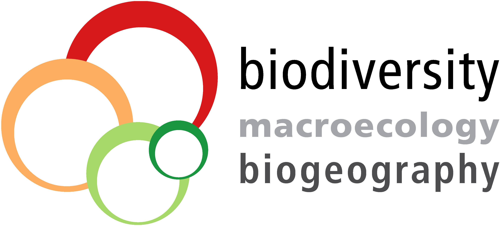

## MCMMB: Modern concepts and methods in macroecology and biogeography

**Instructors**: Patrick Weigelt, Pierre Denelle, Amanda Taylor & Holger Kreft

Please contact us via e-mail with questions about course material 

